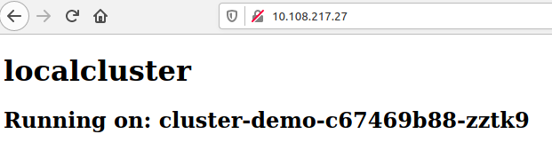

# go-webserver-cluster-demo

- [go-webserver-cluster-demo](#go-webserver-cluster-demo)
  - [Introduction](#introduction)
    - [Example of information visible](#example-of-information-visible)
    - [Result of a rollout to a multi-region (anycasted) Kubernetes cluster](#result-of-a-rollout-to-a-multi-region-anycasted-kubernetes-cluster)
  - [Distribution](#distribution)
  - [Quickstart Kubernetes deployment](#quickstart-kubernetes-deployment)
  - [Environment Variables available](#environment-variables-available)
  - [HTTP Headers available](#http-headers-available)
  - [Custom installation](#custom-installation)
  - [Contributing](#contributing)

## Introduction
This is a very simple webserver written in Go that outputs information via HTML and headers about the running environment such as the hostname / node it's running on. Additionally it can have environment variables configured to set the page title and cluster name.

This is designed to be used with Kubernetes deployments in a cluster or multiple clusters to see if they're working and to print unique information for that cluster. A use case for example is to deploy this to a multi-region anycasted solution in Kubernetes. You could then use https://www.dotcom-tools.com/website-speed-test.aspx (not sponsored) for example to check the resulting screenshots there to see if your routing is working correctly world wide.

### Example of information visible


### Result of a rollout to a multi-region (anycasted) Kubernetes cluster
 Kubernetes cluster")

## Distribution
The code here is automatically build into a docker image and distributed to https://hub.docker.com/r/vhwdev/go-webserver-cluster-demo

## Quickstart Kubernetes deployment
Copy paste the below to your terminal.

```bash
kubectl apply -f https://raw.githubusercontent.com/vvdaal/go-webserver-cluster-demo/master/examples/kubernetes/001-namespace.yaml 
kubectl apply -f https://raw.githubusercontent.com/vvdaal/go-webserver-cluster-demo/master/examples/kubernetes/002-deployments.yaml 
kubectl apply -f https://raw.githubusercontent.com/vvdaal/go-webserver-cluster-demo/master/examples/kubernetes/003-services.yaml 
kubectl apply -f https://raw.githubusercontent.com/vvdaal/go-webserver-cluster-demo/master/examples/kubernetes/004-ingress.yaml
```

This requires a working, configured and authenticated kubectl and will create a new namespace called "cluster-demo" within your Kubernetes cluster together with a deployment, service and ingress of this application using the public Docker image. The ingress is configured to listen on port 80 by default.

## Environment Variables available

|Environment Variable | Default value |
|---|---|
| ListenPort | 80 |
| ClusterName | - |
| PageTitle | Demo test page |

## HTTP Headers available

The following HTTP headers are available with the corresponding information

| HTTP Header name | Value |
|---|---|
| Origin-Cluster-Name | Output of environment value "ClusterName" |
| Origin-Hostname | Output of the hostname |

## Custom installation

For a custom installation or to modify the templates used in the Quickstart Kubernetes deployment, simple check-out this repository and make any modifications you want locally. Feel free to also build the image yourself with any customization and put it in a private repository if you so desire.

## Contributing

Have a great idea to add as information on the webserver? Please open a new branch and create a merge request against mainline.
